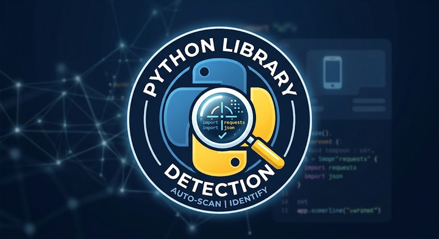

<p align="center">
  
</p>

<h1 align="center">🐍 Python Library Detection & Runtime Auditor</h1>

<p align="center">
  <strong>Auditor forense y monitor en tiempo real del entorno de ejecución de Python</strong><br>
  <em>Inspección estática y dinámica de módulos nativos, dependencias de pip y espacio físico en disco.</em>
</p>

<p align="center">
  
  
  
  
</p>

<p align="center">
  
  
  
  
</p>

---

## 📌 ¿De qué trata esta aplicación?

**Python Library Detection** es una herramienta de escritorio profesional diseñada para desarrolladores, analistas de datos e ingenieros de software que necesitan auditar con precisión quirúrgica su entorno de ejecución de Python.

A diferencia de las herramientas convencionales, opera de forma **100% local y fuera de línea**, garantizando absoluta privacidad y seguridad. Permite identificar al instante qué librerías forman parte de la biblioteca estándar de CPython (`sys.stdlib_module_names`) y cuáles han sido instaladas por gestores de paquetes como `pip` o `conda` (`importlib.metadata`), calculando el espacio exacto que ocupan en el disco duro.

---

## ✨ Características Principales

- 🔄 **Motor de Recarga en Caliente (Hot-Reload)**: Invalida de forma forzada la caché interna de importación de Python (`importlib.invalidate_caches()`), detectando al instante cualquier librería recién instalada vía `pip install` sin necesidad de reiniciar la app.
- 🐍 **Doble Catálogo Especializado**:
  - **Librerías Estándar**: Inspección del catálogo inmutable nativo de CPython.
  - **Librerías Externas**: Listado de paquetes de terceros con su versión, tamaño en disco y descripción.
- 💾 **Medición Forense de Almacenamiento**: Recorre los manifiestos `RECORD` de `site-packages` y evalúa byte por byte el peso de scripts, extensiones compiladas en C (`.pyd` / `.dll`), metadatos y assets.
- 🔍 **Buscador en Tiempo Real**: Filtrado dinámico instantáneo con borrado rápido (`✖`).
- 📊 **Tarjetas de Métricas (KPIs)**: Contadores visuales con el total de módulos nativos, paquetes externos y peso acumulado (KB / MB / GB).
- 🎨 **Interfaz Moderna Cyber Slate**: Tema oscuro de alto contraste con tipografía nítida y filas alternas para evitar fatiga visual.
- 🌐 **Soporte Multi-Idioma**: Cambio fluido con un solo clic entre **Español (ES)** e **Inglés (EN)**.
- 📋 **Menú Contextual (Clic Derecho)**: Opciones rápidas para copiar nombres de paquetes, versiones, consultar en PyPI o abrir la carpeta física de la librería en el Explorador de Windows.
- 🖥️ **Icono de Escritorio y Compilación .EXE**: Incluye herramientas para generar accesos directos oficiales y compilar un ejecutable independiente listo para distribuir.

---

## 📁 Estructura del Proyecto

El proyecto está diseñado bajo una arquitectura limpia y modular:

```text
Detector_Librerías_Python/
├── Media/                          # Recursos gráficos y multimedia
│   ├── app_icon.ico                # Icono multiresolución para Windows
│   ├── app_logo.png                # Logotipo circular oficial de la app
│   └── splash_bg.png               # Banner y fondo para la pantalla de carga
│
├── Estructura/                     # Módulos del código fuente
│   ├── __init__.py                 # Paquete principal
│   ├── config.py                   # Constantes globales, paleta de colores y rutas
│   ├── texts.py                    # Diccionario bilingüe y manual de arquitectura
│   ├── scanner.py                  # Motor forense de auditoría e invalidación de caché
│   ├── utils.py                    # Utilidades de rutas, formateo y accesos directos
│   ├── splash.py                   # Pantalla de carga (Splash Screen) con imagen completa
│   └── app.py                      # Interfaz gráfica principal (Tkinter / ttk Treeviews)
│
├── Otros/                          # Herramientas de soporte y compilación
│   └── compilar_exe.bat            # Script por lotes para compilar a .EXE con 1 clic
│
├── main.py                         # Punto de entrada principal (Bootstrap)
├── README.md                       # Documentación del repositorio
├── LICENSE                         # Licencia de uso y autoría (EnriqueBDL)
├── requirements.txt                # Dependencias del proyecto
└── AGENT.md                        # Directrices y reglas de desarrollo para Agentes IA
```

---

## 🚀 Instalación y Puesta en Marcha

### Prerrequisitos
- Python 3.10 o superior instalado en el sistema.
- Biblioteca `Pillow` (para renderizado de imágenes de alta fidelidad):
  ```bash
  pip install pillow
  ```

### Ejecutar la Aplicación
Para iniciar el auditor, ejecuta:
```bash
python main.py
```

---

## 📦 Compilación a Ejecutable (.EXE)

Para empaquetar la aplicación en un archivo `.exe` único con su icono oficial sin necesidad de consola:

### Método 1 (Recomendado):
Ejecuta el script [`Otros/compilar_exe.bat`](Otros/compilar_exe.bat). Se encargará de compilar el proyecto y generar el archivo oficial `dist/DLP.exe`.

### Método 2 (Manual por Terminal):
```powershell
pip install pyinstaller pillow
pyinstaller --noconsole --onefile --icon="Media/app_icon.ico" --add-data "Media;Media" --name="DLP" main.py
```

---

## ⌨️ Atajos de Teclado

| Atajo | Acción |
| :--- | :--- |
| <kbd>F5</kbd> o <kbd>Ctrl + R</kbd> | **Recargar Entorno** e invalidar caché de Python |
| <kbd>Ctrl + F</kbd> | Enfocar la barra de búsqueda en tiempo real |
| <kbd>Clic Derecho</kbd> | Menú contextual sobre cualquier fila |

---

## 🔒 Privacidad y Seguridad

> [!IMPORTANT]
> **Zero Telemetry / 100% Offline Policy**
> Esta aplicación no realiza peticiones a internet, no recopila datos de usuario ni envía información de las librerías instaladas a ningún servidor remoto.

---

## 👨‍💻 Autor y Créditos

- **Desarrollador Principal**: **EnriqueBDL**
- **Herramientas de Desarrollo**: Diseñado y refinado utilizando **Google Antigravity**, **Visual Studio Code** y **Gemini Pro**.

---

<p align="center">
  Desarrollado por: <strong>EnriqueBDL</strong>
</p>
